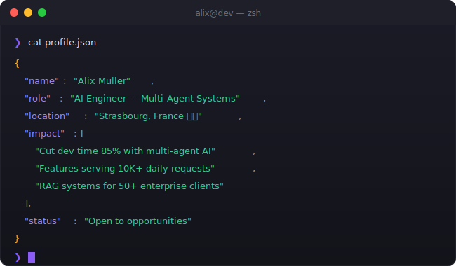

<!-- ═══════════════════════════════════════════════════════════════════════════ -->
<!--     ALIX MULLER — GitHub Profile README                                     -->
<!-- ═══════════════════════════════════════════════════════════════════════════ -->

<div align="center">

<!-- ═══════════════════════════════════════════════════════════════════════════ -->
<!--    ANIMATED HEADER                                                          -->
<!-- ═══════════════════════════════════════════════════════════════════════════ -->



<br/>

<!-- ═══════════════════════════════════════════════════════════════════════════ -->
<!--    PROFILE BADGES                                                           -->
<!-- ═══════════════════════════════════════════════════════════════════════════ -->

<a href="https://alixmuller.com" target="_blank">
  
</a>
&nbsp;
<a href="https://www.linkedin.com/in/alix-muller-124675237" target="_blank">
  
</a>
&nbsp;
<a href="mailto:alix.muller@proton.me">
  
</a>
&nbsp;
<a href="https://github.com/Alixmixx">
  
</a>

</div>

<br/>

<!-- ═══════════════════════════════════════════════════════════════════════════ -->
<!--    TERMINAL INTRO                                                           -->
<!-- ═══════════════════════════════════════════════════════════════════════════ -->

<div align="center">
  
</div>

<br/>


<br/>

<!-- ═══════════════════════════════════════════════════════════════════════════ -->
<!--    ABOUT ME                                                                 -->
<!-- ═══════════════════════════════════════════════════════════════════════════ -->

<div align="center">
  
</div>

<div align="center">
<table width="100%">
<tr>
<td width="50%" valign="top">

### What I Build

```yaml
name: Alix Muller
location: Strasbourg, France
open_to: Remote worldwide | Relocation

expertise:
  - Multi-Agent LLM Pipelines
  - RAG Architectures & Vector DBs
  - Production AI Infrastructure
  - MCP Servers & Agent Tooling
  - Full-Stack AI Applications
```

</td>
<td width="50%" valign="top">

### Current Focus

- **Building** DSPy-powered content pipelines
- **Training** neural networks for chess evaluation
- **Writing** kernels in Rust for fun
- **Shipping** MCP tools for LLM video editing

### Background

- **Ecole 42 Paris** — Top 3% of students
- 2 years building AI systems in **Seoul**
- Former industrial team lead (6 years)
- Former mobile app reverse engineer

</td>
</tr>
</table>
</div>

<br/>


<br/>

<!-- ═══════════════════════════════════════════════════════════════════════════ -->
<!--    EXPERIENCE                                                               -->
<!-- ═══════════════════════════════════════════════════════════════════════════ -->

<div align="center">
  
</div>


```
2d1b69f (HEAD) AI Engineer & Architect @ AppBuildChat, Seoul      — Jun 2025 → Dec 2025
├── Multi-agent LangChain/LangGraph pipeline: PRD → Sprint → Code → Test
├── MCP servers, custom tooling, containerized FastAPI services
└── Result: 40h → 6h per application (85% reduction)

a3f7c2e AI & Software Engineer @ Hypeflow (Mirinae), Seoul        — Mar 2024 → May 2025
├── 3 LLM features serving 10K+ daily requests, <2s latency
├── RAG architecture with vector databases for enterprise platform
└── AI workflow IDE with visual pipeline design for 50+ clients

8b5cf6d Mobile App Reverse Engineer @ Epieos, Paris               — Mar 2023 → Feb 2024
├── Automated API endpoint discovery from decompiled apps
└── GDPR-compliant pipelines under law enforcement protocols

f0e1d2c Technical Team Lead @ TICE Industries, Grand Est          — Sep 2016 → Oct 2022
├── Led teams of 3-4 in high-risk industrial environments
└── 15+ installations delivered on time, zero safety incidents
```

<br/>


<br/>

<!-- ═══════════════════════════════════════════════════════════════════════════ -->
<!--    TECH STACK                                                               -->
<!-- ═══════════════════════════════════════════════════════════════════════════ -->

<div align="center">
  
</div>


<div align="center">

<h4>AI / ML</h4>
<p>
  
  
  
  
  
  
  
</p>

<h4>Languages & Frameworks</h4>
<p>
  <a href="https://skillicons.dev">
    
  </a>
</p>

<h4>Infrastructure & Tools</h4>
<p>
  <a href="https://skillicons.dev">
    
  </a>
  &nbsp;&nbsp;
  
  
  
</p>

</div>

<br/>


<br/>

<!-- ═══════════════════════════════════════════════════════════════════════════ -->
<!--    EDUCATION                                                                -->
<!-- ═══════════════════════════════════════════════════════════════════════════ -->

<div align="center">
  
</div>

<div align="center">
<table width="100%">
<tr>
<td>

### Ecole 42 Paris → Seoul — Top 3%

Completed the intensive peer-to-peer curriculum at **42 Paris**, followed by advanced specializations in **Cybersecurity** and **Kernel Development** at **42 Seoul**.

| Area | Details |
|------|---------|
| **Systems Programming** | Memory allocators, custom shells, game engines — all from scratch |
| **Cybersecurity** | Penetration testing, binary exploitation, reverse engineering |
| **Kernel Development** | Low-level OS programming in Rust |
| **Full-Stack** | Production web applications with complete infrastructure |

</td>
</tr>
</table>
</div>

<div align="center">

[](https://github.com/oakoudad/badge42)

</div>

<br/>


<br/>

<!-- ═══════════════════════════════════════════════════════════════════════════ -->
<!--    CONNECT                                                                  -->
<!-- ═══════════════════════════════════════════════════════════════════════════ -->

<div align="center">
  
</div>


<div align="center">

I'm always interested in discussing **multi-agent architectures**, **RAG at scale**, **AI tooling**, or **interesting engineering challenges**.

<br/>

<a href="https://alixmuller.com" target="_blank">
  
</a>
&nbsp;
<a href="https://www.linkedin.com/in/alix-muller-124675237" target="_blank">
  
</a>
&nbsp;
<a href="mailto:alix.muller@proton.me" target="_blank">
  
</a>


<sub>Strasbourg, France · Open to remote worldwide · Willing to relocate</sub>

</div>

<br/>

<!-- ═══════════════════════════════════════════════════════════════════════════ -->
<!--    FOOTER                                                                   -->
<!-- ═══════════════════════════════════════════════════════════════════════════ -->

<div align="center">
  

  <br/>

  <sub>Design inspired by <a href="https://github.com/red1-for-hek">red1-for-hek</a></sub>
</div>
